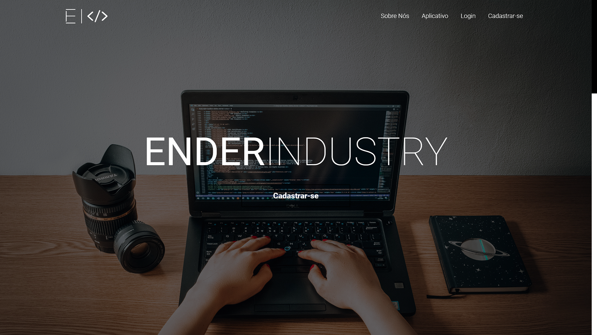
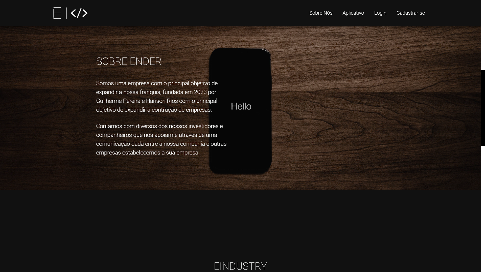
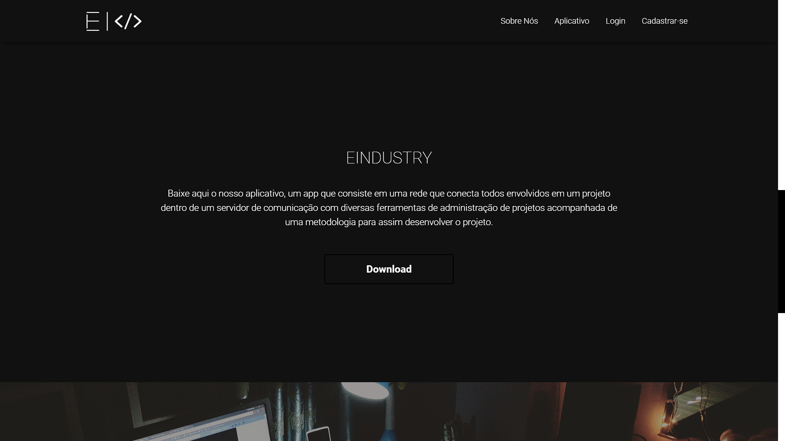
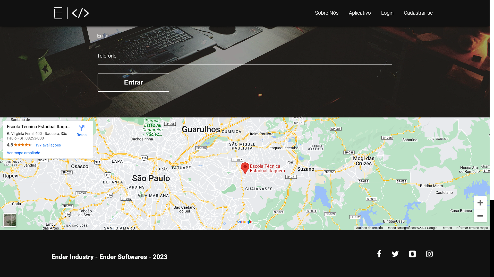

# Projeto Landing Page Básica - Harison Rios 💻

> Landing Page - Imagem 1

> Landing Page - Imagem 2

> Landing Page - Imagem 3

> Landing Page - Imagem 4

## Comentários 

Projeto que foi desenvolvido, durante o ensino técnico na ETEC de Itaquera, sendo trabalho para a matéria de Programação WEB 3

## Tecnologias

        

## 📝 Licença

Esse projeto está sob licença. Veja o arquivo [LICENÇA](LICENSE.md) para mais detalhes.
